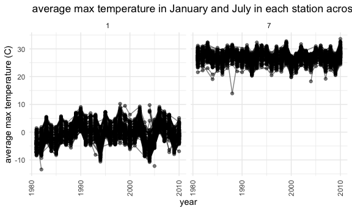
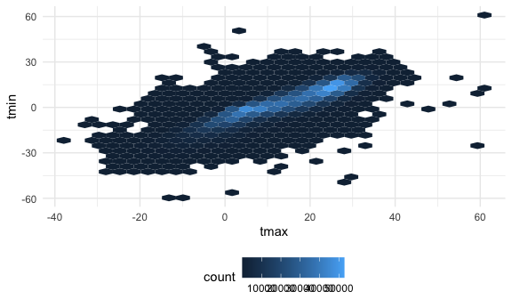
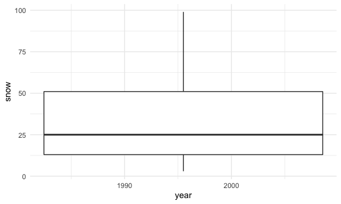

Homework 3
================
Minjie Bao
2020-10-10

### Problem 1

``` r
data("instacart")
```

This dataset contains 1384617 rows and 15 columns.

Observations are the level of items in orders by user. There are user/
order variables – user ID, order ID, order day, and order hour. There
are also item variables – name, aisle, department, and some numeric
codes.

How many aisles, and which are most items from?

``` r
instacart %>% 
  count(aisle) %>% 
  arrange(desc(n))
```

    ## # A tibble: 134 x 2
    ##    aisle                              n
    ##    <chr>                          <int>
    ##  1 fresh vegetables              150609
    ##  2 fresh fruits                  150473
    ##  3 packaged vegetables fruits     78493
    ##  4 yogurt                         55240
    ##  5 packaged cheese                41699
    ##  6 water seltzer sparkling water  36617
    ##  7 milk                           32644
    ##  8 chips pretzels                 31269
    ##  9 soy lactosefree                26240
    ## 10 bread                          23635
    ## # … with 124 more rows

Let’s make a plot

``` r
instacart %>% 
  count(aisle) %>% 
  filter(n>10000) %>% 
  mutate(
    aisle = factor(aisle),
    aisle = fct_reorder(aisle,n)
  ) %>% 
  ggplot(aes(x=aisle, y=n)) +
  geom_point() +
  theme(axis.text.x = element_text(angle = 90, vjust = 0.5, hjust = 1))
```


Let’s make a table\!\!

``` r
instacart %>% 
  filter(aisle %in% c("baking ingredients", "dog food care", "packaged vegetables fruits")) %>% 
  group_by(aisle) %>% 
  count(product_name) %>% 
  mutate(rank = min_rank(desc(n))) %>% 
  filter(rank < 4) %>% 
  arrange(aisle, rank) %>% 
  knitr::kable()
```

| aisle                      | product\_name                                 |    n | rank |
| :------------------------- | :-------------------------------------------- | ---: | ---: |
| baking ingredients         | Light Brown Sugar                             |  499 |    1 |
| baking ingredients         | Pure Baking Soda                              |  387 |    2 |
| baking ingredients         | Cane Sugar                                    |  336 |    3 |
| dog food care              | Snack Sticks Chicken & Rice Recipe Dog Treats |   30 |    1 |
| dog food care              | Organix Chicken & Brown Rice Recipe           |   28 |    2 |
| dog food care              | Small Dog Biscuits                            |   26 |    3 |
| packaged vegetables fruits | Organic Baby Spinach                          | 9784 |    1 |
| packaged vegetables fruits | Organic Raspberries                           | 5546 |    2 |
| packaged vegetables fruits | Organic Blueberries                           | 4966 |    3 |

Apples vs ice cream..

``` r
instacart %>% 
  filter(product_name %in% c("Pink Lady Apples", "Coffee Ice Cream")) %>% 
  group_by(product_name, order_dow) %>% 
  summarize(mean_hour = mean(order_hour_of_day)) %>% 
  pivot_wider(
    names_from = order_dow,
    values_from = mean_hour
  )
```

    ## `summarise()` regrouping output by 'product_name' (override with `.groups` argument)

    ## # A tibble: 2 x 8
    ## # Groups:   product_name [2]
    ##   product_name       `0`   `1`   `2`   `3`   `4`   `5`   `6`
    ##   <chr>            <dbl> <dbl> <dbl> <dbl> <dbl> <dbl> <dbl>
    ## 1 Coffee Ice Cream  13.8  14.3  15.4  15.3  15.2  12.3  13.8
    ## 2 Pink Lady Apples  13.4  11.4  11.7  14.2  11.6  12.8  11.9

### Problem 2

``` r
accel_df =
read_csv("./data/accel_data.csv") %>% 
  janitor::clean_names() %>% 
pivot_longer(
  activity_1 : activity_1440,
    names_to = "minute",
    values_to = "activity_count"
) %>% 
  separate(minute, 
           into = c("char", "minute"),
           convert = TRUE
           ) %>% 
mutate(
  weekday=case_when(
day %in% c("Monday","Tuesday","Wednesday","Thursday","Friday") ~ "weekday",
day %in% c("Saturday","Sunday") ~ "weekend"
),
day = factor(day),
day = forcats::fct_relevel(day, c("Monday","Tuesday","Wednesday","Thursday","Friday","Saturday","Sunday")),
weekday = factor(weekday) 
) %>% 
  select (-c(char))
```

    ## Parsed with column specification:
    ## cols(
    ##   .default = col_double(),
    ##   day = col_character()
    ## )

    ## See spec(...) for full column specifications.

``` r
head(accel_df)
```

    ## # A tibble: 6 x 6
    ##    week day_id day    minute activity_count weekday
    ##   <dbl>  <dbl> <fct>   <int>          <dbl> <fct>  
    ## 1     1      1 Friday      1           88.4 weekday
    ## 2     1      1 Friday      2           82.2 weekday
    ## 3     1      1 Friday      3           64.4 weekday
    ## 4     1      1 Friday      4           70.0 weekday
    ## 5     1      1 Friday      5           75.0 weekday
    ## 6     1      1 Friday      6           66.3 weekday

``` r
count(accel_df)
```

    ## # A tibble: 1 x 1
    ##       n
    ##   <int>
    ## 1 50400

There are 6 variables in the cleaned dataset: week, day\_id, day,
minute, activity\_count, weekday. This dataset contains 50400 rows and 6
columns. There are 50400 observations. The variables “week”, “day\_id”
and “minutes”are double datat ype. “day” and “weekday” are factor datat
ype. “activity” is character data ype.

``` r
accel_df %>% 
group_by(week, day, weekday) %>% 
  summarize(total_activity = sum(activity_count)) %>% 
    knitr::kable(digits = 2)
```

    ## `summarise()` regrouping output by 'week', 'day' (override with `.groups` argument)

| week | day       | weekday | total\_activity |
| ---: | :-------- | :------ | --------------: |
|    1 | Monday    | weekday |        78828.07 |
|    1 | Tuesday   | weekday |       307094.24 |
|    1 | Wednesday | weekday |       340115.01 |
|    1 | Thursday  | weekday |       355923.64 |
|    1 | Friday    | weekday |       480542.62 |
|    1 | Saturday  | weekend |       376254.00 |
|    1 | Sunday    | weekend |       631105.00 |
|    2 | Monday    | weekday |       295431.00 |
|    2 | Tuesday   | weekday |       423245.00 |
|    2 | Wednesday | weekday |       440962.00 |
|    2 | Thursday  | weekday |       474048.00 |
|    2 | Friday    | weekday |       568839.00 |
|    2 | Saturday  | weekend |       607175.00 |
|    2 | Sunday    | weekend |       422018.00 |
|    3 | Monday    | weekday |       685910.00 |
|    3 | Tuesday   | weekday |       381507.00 |
|    3 | Wednesday | weekday |       468869.00 |
|    3 | Thursday  | weekday |       371230.00 |
|    3 | Friday    | weekday |       467420.00 |
|    3 | Saturday  | weekend |       382928.00 |
|    3 | Sunday    | weekend |       467052.00 |
|    4 | Monday    | weekday |       409450.00 |
|    4 | Tuesday   | weekday |       319568.00 |
|    4 | Wednesday | weekday |       434460.00 |
|    4 | Thursday  | weekday |       340291.00 |
|    4 | Friday    | weekday |       154049.00 |
|    4 | Saturday  | weekend |         1440.00 |
|    4 | Sunday    | weekend |       260617.00 |
|    5 | Monday    | weekday |       389080.00 |
|    5 | Tuesday   | weekday |       367824.00 |
|    5 | Wednesday | weekday |       445366.00 |
|    5 | Thursday  | weekday |       549658.00 |
|    5 | Friday    | weekday |       620860.00 |
|    5 | Saturday  | weekend |         1440.00 |
|    5 | Sunday    | weekend |       138421.00 |

Tuesday and Wednesday’s activity is more stable than other days.

``` r
accel_df %>% 
ggplot(aes(x=minute, y=activity_count,color = day)) +
  geom_line(alpha = 0.5) +
  geom_smooth(se = FALSE)
```

    ## `geom_smooth()` using method = 'gam' and formula 'y ~ s(x, bs = "cs")'


This 63 year-old male’s Friday night and Sunday morning’ activity’s
activity accounts are more than other days.

### Problem 3

``` r
data("ny_noaa") 
```

This data set contains 2595176 rows and 7 columns. There are 7
variables: id, date, prcp, snow, snwd, tmax, tmin. There are a lot of
missing values in tmax and tmin. variable prcp has 145838 missing
values, variable tmin has 1134420missing values and variable tmax has
1134358 missing values.

``` r
ny_noaa = ny_noaa %>% 
separate(date, into = c("year", "month", "day"), convert = TRUE) %>% 
  mutate(
    tmax = as.numeric(tmax),
    tmin = as.numeric(tmin),
    prcp = prcp / 10,
    tmax = tmax / 10,
    tmin = tmin / 10
  ) 
```

covert the tmax and tmin from character to numeric because these two
variables are temperature. Covert prcp’s unit to mm and tmax and tmin’s
unit to degree C.

``` r
snow_count = count(ny_noaa, snow) %>% 
  mutate(
    snowfall_rank = min_rank(desc(n))
    )%>% 
arrange(snowfall_rank, by_group = FALSE)
```

For snowfall, the most commonly observed values is 0 mm, the second
commonly observed values is NA and the third commonly observed values is
25 mm. Because there are many missing values. Also, most of the time New
York state doesn’t snow from January 1, 1981 through December 31, 2010.

``` r
ny_noaa %>% 
  group_by(id, year, month) %>% 
  summarise(avg_tmax = mean(tmax, na.rm = TRUE)) %>% 
  filter(month %in% c(1,7)) %>% 
ggplot(aes(x = year, y = avg_tmax, group = id)) +
geom_point(alpha = 0.5) + 
geom_path(alpha = 0.5) +
facet_grid(~ month) + 
labs(title = " average max temperature in January and July in each station across years", x = "year", y = "average max temperature (C)") +
theme(axis.text.x = element_text(angle = 90, vjust = 0.5, hjust = 1))
```

    ## `summarise()` regrouping output by 'id', 'year' (override with `.groups` argument)

    ## Warning: Removed 5970 rows containing missing values (geom_point).

    ## Warning: Removed 5931 row(s) containing missing values (geom_path).



January 2010 is warmer than January in 1980, July 1980 and July 2010 are
almost the same. Therefore we cannot see the global warming. There are
outliers.

``` r
ny_noaa %>% 
  ggplot(aes(x = tmax, y = tmin)) +
geom_hex()
```

    ## Warning: Removed 1136276 rows containing non-finite values (stat_binhex).



``` r
ny_noaa %>% 
filter(snow>0 & snow<100) %>% 
  ggplot(aes(x = year, y = snow)) +
geom_boxplot()
```

    ## Warning: Continuous x aesthetic -- did you forget aes(group=...)?


