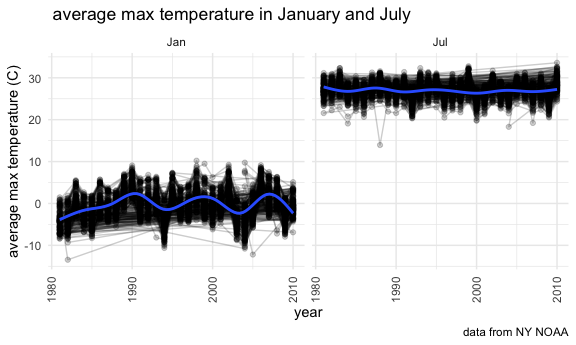

Homework 3
================
Minjie Bao
2020-10-10

### Problem 1

``` r
data("instacart")
```

This dataset contains 1384617 rows and 15 columns.

Observations are the level of items in orders by user. There are user/
order variables – user ID, order ID, order day, and order hour. There
are also item variables – name, aisle, department, and some numeric
codes.

How many aisles, and which are most items from?

``` r
instacart %>% 
  count(aisle) %>% 
  arrange(desc(n))
```

    ## # A tibble: 134 x 2
    ##    aisle                              n
    ##    <chr>                          <int>
    ##  1 fresh vegetables              150609
    ##  2 fresh fruits                  150473
    ##  3 packaged vegetables fruits     78493
    ##  4 yogurt                         55240
    ##  5 packaged cheese                41699
    ##  6 water seltzer sparkling water  36617
    ##  7 milk                           32644
    ##  8 chips pretzels                 31269
    ##  9 soy lactosefree                26240
    ## 10 bread                          23635
    ## # … with 124 more rows

Let’s make a plot

``` r
instacart %>% 
  count(aisle) %>% 
  filter(n>10000) %>% 
  mutate(
    aisle = factor(aisle),
    aisle = fct_reorder(aisle,n)
  ) %>% 
  ggplot(aes(x=aisle, y=n)) +
  geom_point() +
  theme(axis.text.x = element_text(angle = 90, vjust = 0.5, hjust = 1))
```


Let’s make a table\!\!

``` r
instacart %>% 
  filter(aisle %in% c("baking ingredients", "dog food care", "packaged vegetables fruits")) %>% 
  group_by(aisle) %>% 
  count(product_name) %>% 
  mutate(rank = min_rank(desc(n))) %>% 
  filter(rank < 4) %>% 
  arrange(aisle, rank) %>% 
  knitr::kable()
```

| aisle                      | product\_name                                 |    n | rank |
| :------------------------- | :-------------------------------------------- | ---: | ---: |
| baking ingredients         | Light Brown Sugar                             |  499 |    1 |
| baking ingredients         | Pure Baking Soda                              |  387 |    2 |
| baking ingredients         | Cane Sugar                                    |  336 |    3 |
| dog food care              | Snack Sticks Chicken & Rice Recipe Dog Treats |   30 |    1 |
| dog food care              | Organix Chicken & Brown Rice Recipe           |   28 |    2 |
| dog food care              | Small Dog Biscuits                            |   26 |    3 |
| packaged vegetables fruits | Organic Baby Spinach                          | 9784 |    1 |
| packaged vegetables fruits | Organic Raspberries                           | 5546 |    2 |
| packaged vegetables fruits | Organic Blueberries                           | 4966 |    3 |

Apples vs ice cream..

``` r
instacart %>% 
  filter(product_name %in% c("Pink Lady Apples", "Coffee Ice Cream")) %>% 
  group_by(product_name, order_dow) %>% 
  summarize(mean_hour = mean(order_hour_of_day)) %>% 
  pivot_wider(
    names_from = order_dow,
    values_from = mean_hour
  )
```

    ## `summarise()` regrouping output by 'product_name' (override with `.groups` argument)

    ## # A tibble: 2 x 8
    ## # Groups:   product_name [2]
    ##   product_name       `0`   `1`   `2`   `3`   `4`   `5`   `6`
    ##   <chr>            <dbl> <dbl> <dbl> <dbl> <dbl> <dbl> <dbl>
    ## 1 Coffee Ice Cream  13.8  14.3  15.4  15.3  15.2  12.3  13.8
    ## 2 Pink Lady Apples  13.4  11.4  11.7  14.2  11.6  12.8  11.9

### Problem 2

``` r
accel_df =
read_csv("./data/accel_data.csv") %>% 
  janitor::clean_names() %>% 
pivot_longer(
  activity_1 : activity_1440,
    names_to = "minute",
    values_to = "activity_count"
) %>% 
mutate(
  weekday=case_when(
day %in% c("Monday","Tuesday","Wednesday","Thursday","Friday") ~ "weekday",
day %in% c("Saturday","Sunday") ~ "weekend"
),
day = factor(day),
day = forcats::fct_relevel(day, c("Monday","Tuesday","Wednesday","Thursday","Friday","Saturday","Sunday")),
weekday = factor(weekday) 
)
```

    ## Parsed with column specification:
    ## cols(
    ##   .default = col_double(),
    ##   day = col_character()
    ## )

    ## See spec(...) for full column specifications.

``` r
head(accel_df)
```

    ## # A tibble: 6 x 6
    ##    week day_id day    minute     activity_count weekday
    ##   <dbl>  <dbl> <fct>  <chr>               <dbl> <fct>  
    ## 1     1      1 Friday activity_1           88.4 weekday
    ## 2     1      1 Friday activity_2           82.2 weekday
    ## 3     1      1 Friday activity_3           64.4 weekday
    ## 4     1      1 Friday activity_4           70.0 weekday
    ## 5     1      1 Friday activity_5           75.0 weekday
    ## 6     1      1 Friday activity_6           66.3 weekday

``` r
count(accel_df)
```

    ## # A tibble: 1 x 1
    ##       n
    ##   <int>
    ## 1 50400

There are 6 variables in the cleaned dataset: week, day\_id, day,
minute, activity\_count, weekday. This dataset contains 50400 rows and 6
columns. There are 50400 observations. The variables: “week”, “day\_id”
and “activity\_count” are double data type. “day” and “weekday” are
factor data type. “minute” is character data type.

``` r
accel_df %>% 
group_by(week, day) %>% 
  summarize(total_activity = sum(activity_count)) %>% 
    knitr::kable(digits = 2)
```

    ## `summarise()` regrouping output by 'week' (override with `.groups` argument)

| week | day       | total\_activity |
| ---: | :-------- | --------------: |
|    1 | Monday    |        78828.07 |
|    1 | Tuesday   |       307094.24 |
|    1 | Wednesday |       340115.01 |
|    1 | Thursday  |       355923.64 |
|    1 | Friday    |       480542.62 |
|    1 | Saturday  |       376254.00 |
|    1 | Sunday    |       631105.00 |
|    2 | Monday    |       295431.00 |
|    2 | Tuesday   |       423245.00 |
|    2 | Wednesday |       440962.00 |
|    2 | Thursday  |       474048.00 |
|    2 | Friday    |       568839.00 |
|    2 | Saturday  |       607175.00 |
|    2 | Sunday    |       422018.00 |
|    3 | Monday    |       685910.00 |
|    3 | Tuesday   |       381507.00 |
|    3 | Wednesday |       468869.00 |
|    3 | Thursday  |       371230.00 |
|    3 | Friday    |       467420.00 |
|    3 | Saturday  |       382928.00 |
|    3 | Sunday    |       467052.00 |
|    4 | Monday    |       409450.00 |
|    4 | Tuesday   |       319568.00 |
|    4 | Wednesday |       434460.00 |
|    4 | Thursday  |       340291.00 |
|    4 | Friday    |       154049.00 |
|    4 | Saturday  |         1440.00 |
|    4 | Sunday    |       260617.00 |
|    5 | Monday    |       389080.00 |
|    5 | Tuesday   |       367824.00 |
|    5 | Wednesday |       445366.00 |
|    5 | Thursday  |       549658.00 |
|    5 | Friday    |       620860.00 |
|    5 | Saturday  |         1440.00 |
|    5 | Sunday    |       138421.00 |

There’s no apparent trends, but it seems like Tuesday and Wednesday’s
total activity is more stable than other days.

``` r
accel_df %>% 
    separate(minute, 
           into = c("char", "minute"),
           convert = TRUE
           ) %>% 
  select (-c(char)) %>% 
ggplot(aes(x=minute, y=activity_count,color = day)) +
  geom_line() +
  geom_smooth(se = FALSE) +
  labs(title = "24-hour activity time")
```

    ## `geom_smooth()` using method = 'gam' and formula 'y ~ s(x, bs = "cs")'


From the plot we can see that this 63 year-old male has more activity on
Friday night and Sunday morning than other days.

### Problem 3

``` r
data("ny_noaa") 
```

This data set contains 2595176 rows and 7 columns. The size of the data
set is 2595176 \* 7. There are 7 variables: id, date, prcp, snow, snwd,
tmax, tmin. There’ are’s an issue that too many missing values in tmax
and tmin. Variable “tmin” has 1134420missing values and variable “tmax”
has 1134358 missing values.

``` r
ny_noaa = ny_noaa %>% 
separate(date, into = c("year", "month", "day"), convert = TRUE) %>% 
  mutate(
    tmax = as.numeric(tmax),
    tmin = as.numeric(tmin),
    prcp = prcp / 10,
    tmax = tmax / 10,
    tmin = tmin / 10
  ) 
print(ny_noaa)
```

    ## # A tibble: 2,595,176 x 9
    ##    id           year month   day  prcp  snow  snwd  tmax  tmin
    ##    <chr>       <int> <int> <int> <dbl> <int> <int> <dbl> <dbl>
    ##  1 US1NYAB0001  2007    11     1    NA    NA    NA    NA    NA
    ##  2 US1NYAB0001  2007    11     2    NA    NA    NA    NA    NA
    ##  3 US1NYAB0001  2007    11     3    NA    NA    NA    NA    NA
    ##  4 US1NYAB0001  2007    11     4    NA    NA    NA    NA    NA
    ##  5 US1NYAB0001  2007    11     5    NA    NA    NA    NA    NA
    ##  6 US1NYAB0001  2007    11     6    NA    NA    NA    NA    NA
    ##  7 US1NYAB0001  2007    11     7    NA    NA    NA    NA    NA
    ##  8 US1NYAB0001  2007    11     8    NA    NA    NA    NA    NA
    ##  9 US1NYAB0001  2007    11     9    NA    NA    NA    NA    NA
    ## 10 US1NYAB0001  2007    11    10    NA    NA    NA    NA    NA
    ## # … with 2,595,166 more rows

``` r
snow_count = count(ny_noaa, snow) %>% 
  mutate(
    snowfall_rank = min_rank(desc(n))
    )%>% 
arrange(snowfall_rank, by_group = FALSE)
print(snow_count)
```

    ## # A tibble: 282 x 3
    ##     snow       n snowfall_rank
    ##    <int>   <int>         <int>
    ##  1     0 2008508             1
    ##  2    NA  381221             2
    ##  3    25   31022             3
    ##  4    13   23095             4
    ##  5    51   18274             5
    ##  6    76   10173             6
    ##  7     8    9962             7
    ##  8     5    9748             8
    ##  9    38    9197             9
    ## 10     3    8790            10
    ## # … with 272 more rows

In this step, I covert variables: tmax and tmin from character to
numeric because these two variables are temperature. I also divided
prcp, tmax and tmin by 10 to make them in resonable units. Now prcp has
unit: mm, tmax and tmin has units: degrees C.

For snowfall, the most commonly observed values is 0 mm because most of
the timefrom January 1, 1981 through December 31, 2010, New York state
doesn’t snow.The second commonly observed values is NA because there are
381221 missing values. The third commonly observed values is 25 mm
because ny state normally doesn’t rain a lot through the 30 years.

``` r
ny_noaa %>% 
  group_by(id, year, month) %>% 
  summarise(avg_tmax = mean(tmax, na.rm = TRUE)) %>% 
  filter(month %in% c(1,7)) %>% 
  drop_na() %>% 
ggplot(aes(x = year, y = avg_tmax)) +
geom_point() + 
geom_path(alpha = 0.1) +
  geom_smooth(se = TRUE) +
facet_grid(.~ month) + 
labs(title = " average max temperature in January and July in each station across years", x = "year", y = "average max temperature (C)") +
theme(axis.text.x = element_text(angle = 90, vjust = 0.5, hjust = 1))
```

    ## `summarise()` regrouping output by 'id', 'year' (override with `.groups` argument)

    ## `geom_smooth()` using method = 'gam' and formula 'y ~ s(x, bs = "cs")'



The average max temperature in July is higher than January. In January,
we can see that the average max temperature in each station across the
years is oscillating. In July, the average max temperature in each
station across the years is more stable than January. Therefore, we
cannot conclude that the temperature is warming across years or global
warming. There are many outliers in the graph such as the points around
January 1982, and July 1988.

``` r
tmax_tmin_plot =
ny_noaa %>% 
  ggplot(aes(x = tmax, y = tmin)) +
geom_hex() +
    labs(title = "tmax_vs_tmin")

snowfall_plot = 
ny_noaa %>% 
filter(snow>0 & snow<100) %>% 
  ggplot(aes(x = year, y = snow, group = year)) +
geom_boxplot() +
  labs(title = " snowfall_plot")

tmax_tmin_plot + snowfall_plot
```

    ## Warning: Removed 1136276 rows containing non-finite values (stat_binhex).


